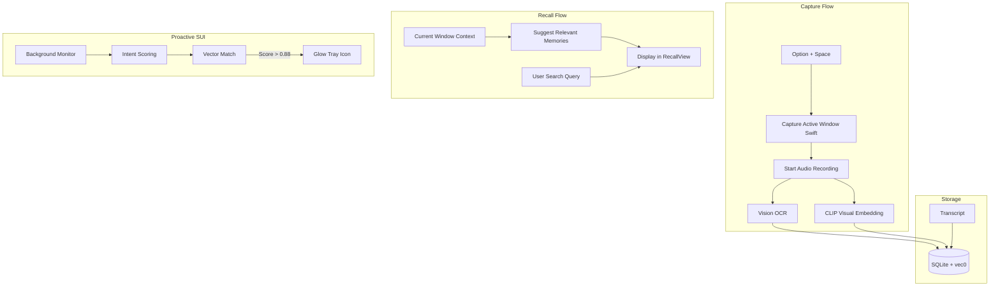

# Yaad v2.0 Implementation Plan

This plan follows an iterative approach to upgrade Yaad from a passive memory app to a "Proactive Wingman," leveraging macOS native APIs and local AI models.

## Phase 1: Native Visual Capture (The "Eyes")

Implement one-shot screenshot capture of the active window using `SCScreenshotManager`.

- **Swift Bridge Setup:** 
    - Add `swift-rs = "1.0.7"` to [`src-tauri/Cargo.toml`](src-tauri/Cargo.toml).
    - Update [`src-tauri/build.rs`](src-tauri/build.rs) to compile Swift code.
    - Create `src-tauri/src/swift/lib.swift` with `capture_active_window` using `ScreenCaptureKit`.
- **Backend:** Create a Tauri command `capture_active_window` in [`src-tauri/src/commands.rs`](src-tauri/src/commands.rs).
- **Frontend:** Update [`src/components/CaptureView.tsx`](src/components/CaptureView.tsx) to trigger capture on recording start.

## Phase 2: Visual Intelligence (OCR & Indexing)

Make the captured window searchable via text (OCR) and visual context (CLIP).

- **OCR Integration:** Extend Swift bridge to use `Vision` framework for text extraction.
- **Visual Indexing:** 
    - Add `ort` (ONNX Runtime) with `coreml` feature for CLIP embeddings.
    - Implement model download logic in [`src-tauri/src/models.rs`](src-tauri/src/models.rs).
- **Database:** Update [`src-tauri/src/db.rs`](src-tauri/src/db.rs) schema to store OCR text and visual embeddings.
- **Save Flow:** Update `save_memory` in [`src-tauri/src/commands.rs`](src-tauri/src/commands.rs) to process and store visual data.

## Phase 3: Contextual Intelligence (Passive Recall)

Show relevant memories automatically based on the current active window.

- **Detection:** Implement a helper to get the active window's title/URL (via `NSWorkspace`).
- **Matching:** Update `search_memories` to perform vector search against current context embeddings.
- **UI:** Update [`src/components/RecallView.tsx`](src/components/RecallView.tsx) to display "Suggested Memories" before the user starts typing.

## Phase 4: Proactive SUI & Tray Glow

Alert the user to relevant memories via a tray icon "glow" (icon swap).

- **Monitor:** Add a background loop in Rust to periodically check the active window context.
- **Intent Scoring:** Implement regex-based "High-Intent" scoring (checkout, billing, etc.) in Rust.
- **Tray Logic:** Implement icon swapping in the tray when a high-confidence match is found.
- **Rules:** Apply 3-second temporal confirmation and 15-minute cooldown.

## Phase 5: UI Refinements (Morphing Bar)

Enhance the recording/typing transition and polish animations.

- **Interaction:** Update [`src/components/CaptureView.tsx`](src/components/CaptureView.tsx) so the first keystroke stops the microphone and switches to text mode.
- **Animations:** Refine the transition between "Pill" (recording) and "Review" (editing) states.

---

### Implementation Mermaid Diagram

